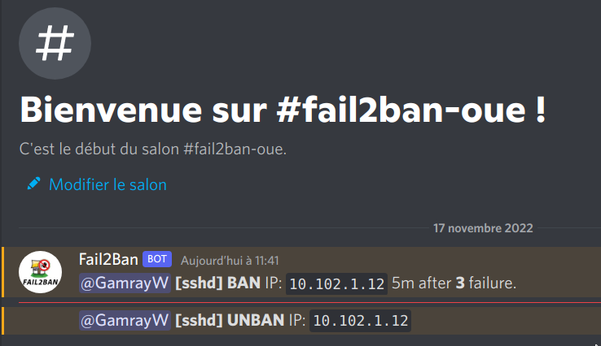

# Module 7 : Fail2Ban


En suivant [ce tuto](https://www.digitalocean.com/community/tutorials/how-to-protect-ssh-with-fail2ban-on-rocky-linux-8)

```
[user@web ~]$ sudo dnf install fail2ban -y
	[...]
	Complete!
```

```
[user@web fail2ban]$ sudo cp jail.conf jail.local
```

```
[DEFAULT]
bantime  = 5m
findtime = 5m
maxretry = 3

[sshd]
enabled  = true
```

```
[user@web fail2ban]$ sudo systemctl enable fail2ban
Created symlink /etc/systemd/system/multi-user.target.wants/fail2ban.service → /usr/lib/systemd/system/fail2ban.service.
[user@web fail2ban]$ sudo systemctl start fail2ban
```

## Vérifs

```
[user@db ~]$ ssh user@10.102.1.11
user@10.102.1.11's password: 
Permission denied, please try again.
user@10.102.1.11's password: 
Permission denied, please try again.
user@10.102.1.11's password: 
user@10.102.1.11: Permission denied (publickey,gssapi-keyex,gssapi-with-mic,password).
[user@db ~]$ ssh user@10.102.1.11
ssh: connect to host 10.102.1.11 port 22: Connection refused
```

```
[user@web fail2ban]$ sudo fail2ban-client status sshd
Status for the jail: sshd
|- Filter
|  |- Currently failed:	0
|  |- Total failed:	3
|  `- Journal matches:	_SYSTEMD_UNIT=sshd.service + _COMM=sshd
`- Actions
   |- Currently banned:	1
   |- Total banned:	1
   `- Banned IP list:	10.102.1.12
```

```
[user@web fail2ban]$ sudo iptables -n -L
	[...]
Chain f2b-sshd (1 references)
target     prot opt source               destination         
REJECT     all  --  10.102.1.12          0.0.0.0/0            reject-with icmp-port-unreachable
RETURN     all  --  0.0.0.0/0            0.0.0.0/0    
```

```
[user@web fail2ban]$ sudo fail2ban-client set sshd unbanip 10.102.1.12
0

[user@web fail2ban]$ sudo iptables -n -L
	[...]
Chain f2b-sshd (1 references)
target     prot opt source               destination         
RETURN     all  --  0.0.0.0/0            0.0.0.0/0  
```

## Bonus - intégration discord

```
[user@web fail2ban]$ cat action.d/discord_notifications.conf 
# Author: Gilbn from https://technicalramblings.com
# Adapted Source: https://gist.github.com/sander1/075736a42db2c66bc6ce0fab159ca683
# Create the Discord Webhook in: Server settings -> Webhooks -> Create Webhooks
# Modified for TP LINUX 3

[Definition]

actioncheck =

# Notify on Banned 
actionban = curl -X POST "<webhook>" \
            -H "Content-Type: application/json" \
            -d '{"username":"Fail2Ban", "content":"<discord_userid> **[<name>]** **BAN** IP: `<ip>` 5m after **<failures>** failure."}' 
            curl -X POST "<webhook>" \
            -H "Content-Type: application/json" \
            -d '{"username":"Fail2Ban", "content":""}'

# Notify on Unbanned
actionunban = curl -X POST "<webhook>" \
            -H "Content-Type: application/json" \
            -d '{"username":"Fail2Ban", "content":"<discord_userid> **[<name>]** **UNBAN** IP: `<ip>`"}'
[Init]

# Name of the jail in your jail.local file. default = [your-jail-name]
name = default


webhook = https://discord.com/api/webhooks/<redacted>
```

```
[user@web fail2ban]$ cat jail.local
	[...]
#
# ACTIONS
#
	[...]
# Ban & ping discord
action_ping = %(action_)s
	      discord_notifications[discord_userid=<@330791198254039042>]
	[...]
action = %(action_ping)s
	[...]
```

