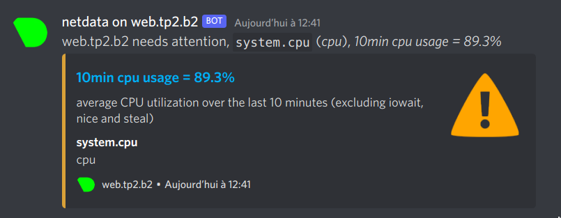

# Module 5 : Monitoring

```
[user@web ~]$ wget -O /tmp/netdata-kickstart.sh https://my-netdata.io/kickstart.sh && sh /tmp/netdata-kickstart.sh
[user@web ~]$ sudo systemctl start netdata
[user@web ~]$ sudo systemctl enable netdata
[user@web ~]$ sudo systemctl status netdata
● netdata.service - Real time performance monitoring
     Loaded: loaded (/usr/lib/systemd/system/netdata.service; enabled; vendor preset: disabled)
     Active: active (running) since Thu 2022-11-17 12:00:21 CET; 3min 9s ago
```
```
[user@web ~]$ curl http://localhost:19999
<!doctype html>
	[...]

[user@web ~]$ sudo firewall-cmd --permanent --add-port=19999/tcp
success
[user@web ~]$ sudo firewall-cmd --reload
success
[user@web ~]$ sudo firewall-cmd --runtime-to-permanent
success
```

```
 ╭─gammray@manjaro in repo: linux-reseau-leo/linux/tp3/2-Module_5_Monitoring on  main [?] took 8ms
 ╰─λ curl http://web.tp2.linux:19999
<!doctype html>
	[...]
```

```
[user@web netdata]$ sudo ./edit-config health_alarm_notify.conf
# enable/disable sending discord notifications
SEND_DISCORD="YES"

# Create a webhook by following the official documentation -
# https://support.discordapp.com/hc/en-us/articles/228383668-Intro-to-Webhooks
DISCORD_WEBHOOK_URL="https://discordapp.com/api/webhooks/<redacted>"

# if a role's recipients are not configured, a notification will be send to
# this discord channel (empty = do not send a notification for unconfigured
# roles):
DEFAULT_RECIPIENT_DISCORD="alarms"
```

## Testing 
```
[user@web tmp]$ stress-ng --matrix 1 -t 9m
```

