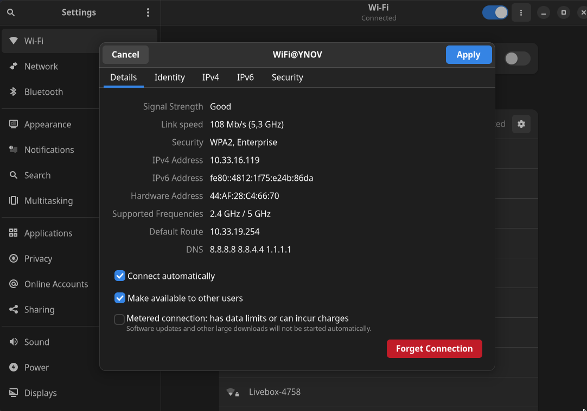
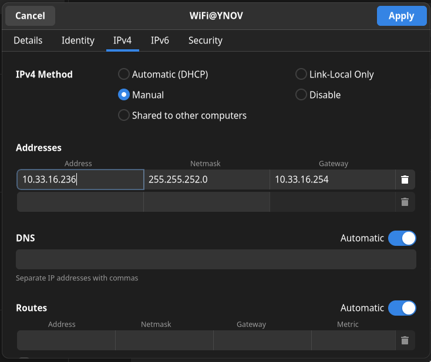
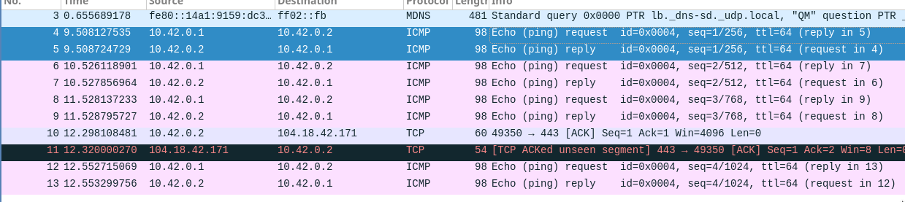
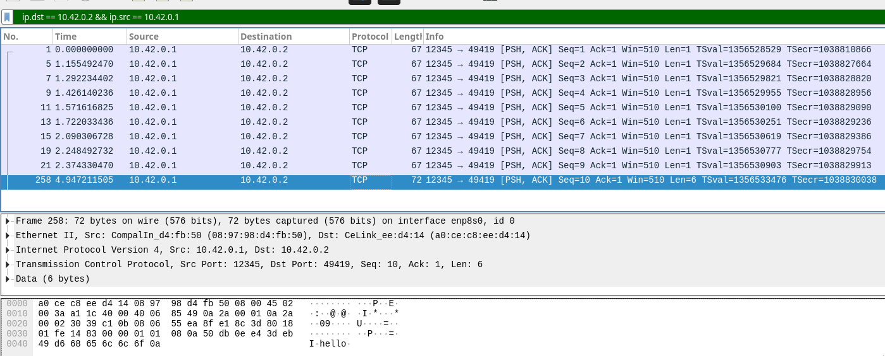
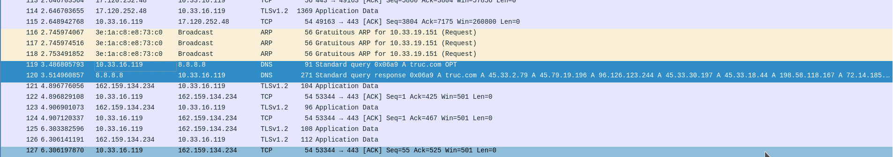

# Sommaire
- [B2 Réseau 2022 - TP1](#b2-réseau-2022---tp1)
- [TP1 - Mise en jambes](#tp1---mise-en-jambes)
- [Sommaire](#sommaire)
- [Déroulement et rendu du TP](#déroulement-et-rendu-du-tp)
- [I. Exploration locale en solo](#i-exploration-locale-en-solo)
  - [1. Affichage d'informations sur la pile TCP/IP locale](#1-affichage-dinformations-sur-la-pile-tcpip-locale)
    - [En ligne de commande](#en-ligne-de-commande)
    - [En graphique (GUI : Graphical User Interface)](#en-graphique-gui--graphical-user-interface)
    - [Questions](#questions)
  - [2. Modifications des informations](#2-modifications-des-informations)
    - [A. Modification d'adresse IP (part 1)](#a-modification-dadresse-ip-part-1)
    - [B. Table ARP](#b-table-arp)
    - [C. `nmap`](#c-nmap)
    - [D. Modification d'adresse IP (part 2)](#d-modification-dadresse-ip-part-2)
- [II. Exploration locale en duo](#ii-exploration-locale-en-duo)
  - [1. Prérequis](#1-prérequis)
  - [2. Câblage](#2-câblage)
  - [Création du réseau (oupa)](#création-du-réseau-oupa)
  - [3. Modification d'adresse IP](#3-modification-dadresse-ip)
  - [4. Utilisation d'un des deux comme gateway](#4-utilisation-dun-des-deux-comme-gateway)
  - [5. Petit chat privé](#5-petit-chat-privé)
  - [6. Firewall](#6-firewall)
- [III. Manipulations d'autres outils/protocoles côté client](#iii-manipulations-dautres-outilsprotocoles-côté-client)
  - [1. DHCP](#1-dhcp)
  - [2. DNS](#2-dns)
- [IV. Wireshark](#iv-wireshark)
- [Bilan](#bilan)

# Déroulement et rendu du TP

//

**⚠️ ⚠️ Désactivez votre firewall pour ce TP. ⚠️ ⚠️**

# I. Exploration locale en solo

## 1. Affichage d'informations sur la pile TCP/IP locale

### En ligne de commande

En utilisant la ligne de commande (CLI) de votre OS :

**🌞 Affichez les infos des cartes réseau de votre PC**

- interface wifi : wlp0s20f3, 44:af:28:c4:66:70, 10.33.16.119/22
- interface Ethernet : enp8s0, 08:97:98:d4:fb:50, pas d'adresse IP
```
$ ip a
1: lo: <LOOPBACK,UP,LOWER_UP> mtu 65536 qdisc noqueue state UNKNOWN group default qlen 1000
    link/loopback 00:00:00:00:00:00 brd 00:00:00:00:00:00
    inet 127.0.0.1/8 scope host lo
       valid_lft forever preferred_lft forever
    inet6 ::1/128 scope host 
       valid_lft forever preferred_lft forever
2: enp8s0: <NO-CARRIER,BROADCAST,MULTICAST,UP> mtu 1500 qdisc fq_codel state DOWN group default qlen 1000
    link/ether 08:97:98:d4:fb:50 brd ff:ff:ff:ff:ff:ff
3: wlp0s20f3: <BROADCAST,MULTICAST,UP,LOWER_UP> mtu 1500 qdisc noqueue state UP group default qlen 1000
    link/ether 44:af:28:c4:66:70 brd ff:ff:ff:ff:ff:ff
    inet 10.33.16.119/22 brd 10.33.19.255 scope global dynamic noprefixroute wlp0s20f3
       valid_lft 76666sec preferred_lft 76666sec
```

**🌞 Affichez votre gateway**

- utilisez une commande pour connaître l'adresse IP de la [passerelle](../../cours/lexique.md#passerelle-ou-gateway) de votre carte WiFi
```
$ ip n s
10.33.19.254 dev wlp0s20f3 lladdr 00:c0:e7:e0:04:4e REACHABLE
```

### En graphique (GUI : Graphical User Interface)

En utilisant l'interface graphique de votre OS :  

**🌞 Trouvez comment afficher les informations sur une carte IP (change selon l'OS)**

- trouvez l'IP, la MAC et la [gateway](../../cours/lexique.md#passerelle-ou-gateway) pour l'interface WiFi de votre PC
(10.33.16.119, 44:AF:28:C4:66:70, 10.33.19.254)



### Questions

- 🌞 à quoi sert la [gateway](../../cours/lexique.md#passerelle-ou-gateway) dans le réseau d'YNOV ?
- La gateway sert à connecter le LAN d'Ynov aux autres LAN sur internet ( à avoir internet quoi )

## 2. Modifications des informations

### A. Modification d'adresse IP (part 1)  

🌞 Utilisez l'interface graphique de votre OS pour **changer d'adresse IP** :

- changez l'adresse IP de votre carte WiFi pour une autre
- ne changez que le dernier octet
  - par exemple pour `10.33.1.10`, ne changez que le `10`
  - valeur entre 1 et 254 compris


```
$ ip a
  [...]
  3: wlp0s20f3: <BROADCAST,MULTICAST,UP,LOWER_UP> mtu 1500 qdisc noqueue state UP group default qlen 1000
    link/ether 44:af:28:c4:66:70 brd ff:ff:ff:ff:ff:ff
    inet 10.33.16.236/22 brd 10.33.19.255 scope global noprefixroute wlp0s20f3
       valid_lft forever preferred_lft forever
  [...]

$ ping 8.8.8.8
PING 8.8.8.8 (8.8.8.8) 56(84) bytes of data.
From 10.33.16.236 icmp_seq=1 Destination Host Unreachable
From 10.33.16.236 icmp_seq=2 Destination Host Unreachable
From 10.33.16.236 icmp_seq=3 Destination Host Unreachable
```

🌞 **Il est possible que vous perdiez l'accès internet.** Que ce soit le cas ou non, expliquez pourquoi c'est possible de perdre son accès internet en faisant cette opération.

- L'adresse IP que j'ai choisie (10.33.16.236) est déjà prise, donc je n'ai plus accès à internet.

---

- **NOTE :** si vous utilisez la même IP que quelqu'un d'autre, il se passerait la même chose qu'en vrai avec des adresses postales :
  - deux personnes habitent au même numéro dans la même rue, mais dans deux maisons différentes
  - quand une de ces personnes envoie un message, aucun problème, l'adresse du destinataire est unique, la lettre sera reçue
  - par contre, pour envoyer un message à l'une de ces deux personnes, le facteur sera dans l'impossibilité de savoir dans quelle boîte aux lettres il doit poser le message
  - ça marche à l'aller, mais pas au retour

### B. Table ARP

La table ARP c'est votre "table de voisinnage". Elle contient la liste des adresses MAC des machines avec qui vous avez communiqué récemment.

Quand deux machines communiquent, elles enregistrent mutuellement l'adresse MAC et l'adresse IP de l'autre dans cette table.

> L'échange d'adresse MAC se fait de façon automatique, dès qu'on essaie de contacter une machine via son IP, et se fait à l'aide du protocole ARP, que nous verrons plus tard.

🌞 Exploration de la table ARP

```
$ ip neighbor
10.33.19.254 dev wlp0s20f3 lladdr 00:c0:e7:e0:04:4e REACHABLE
```
- depuis la ligne de commande, afficher la table ARP
- identifier l'adresse MAC de la passerelle de votre réseau, et expliquer comment vous avez repéré cette adresse MAC spécifiquement

Je sais que l'adresse de la passerelle est probablement x.x.x.234 donc, son adresse mac est 00:c0:e7:e0:04:4e ( et puis c'est aussi la seule entrée dans la table arp donc c'est forcément la gateway )

🌞 Et si on remplissait un peu la table ?

- envoyez des ping vers des IP du même réseau que vous. Lesquelles ? menfou, random. Envoyez des ping vers au moins 3-4 machines.
- affichez votre table ARP
- listez les adresses MAC associées aux adresses IP que vous avez ping

```
$ ip neighbor
10.33.19.236 dev wlp0s20f3 FAILED 
10.33.19.110 dev wlp0s20f3 FAILED 
10.33.19.254 dev wlp0s20f3 lladdr 00:c0:e7:e0:04:4e DELAY 
10.33.19.111 dev wlp0s20f3 FAILED
```
---

Ping des IP pour savoir si elles sont disponibles, c'est possible, mais c'est chiant.  
Ca serait bien un outil pour scanner le réseau à un instant T afin de choisir une adresse IP libre, non ? oui

# II. Exploration locale en duo
## 1. Prérequis

- deux PCs avec ports RJ45
- un câble RJ45
- **firewalls désactivés** sur les deux PCs

## 2. Câblage

Ok c'est la partie tendue. Prenez un câble. Branchez-le des deux côtés. **Bap.**

## Création du réseau (oupa)

Cette étape peut paraître cruciale. En réalité, elle n'existe pas à proprement parlé. On ne peut pas "créer" un réseau. Si une machine possède une carte réseau, et si cette carte réseau porte une adresse IP, alors cette adresse IP se trouve dans un réseau (l'adresse de réseau). Ainsi, le réseau existe. De fait.  

**Donc il suffit juste de définir une adresse IP sur une carte réseau pour que le réseau existe ! Bap.**

## 3. Modification d'adresse IP

🌞Si vos PCs ont un port RJ45 alors y'a une carte réseau Ethernet associée :
```
$ ping 10.42.0.2
PING 10.42.0.2 (10.42.0.2) 56(84) bytes of data.
64 bytes from 10.42.0.2: icmp_seq=1 ttl=64 time=0.481 ms
64 bytes from 10.42.0.2: icmp_seq=2 ttl=64 time=0.930 ms
64 bytes from 10.42.0.2: icmp_seq=3 ttl=64 time=1.30 ms
64 bytes from 10.42.0.2: icmp_seq=4 ttl=64 time=0.638 ms
``` 
```
$ ip n
10.33.19.254 dev wlp0s20f3 lladdr 00:c0:e7:e0:04:4e REACHABLE 
10.42.0.2 dev enp8s0 lladdr a0:ce:c8:ee:d4:14 STALE 
```

## 4. Utilisation d'un des deux comme gateway

- vous allez désactiver Internet sur une des deux machines, et vous servir de l'autre machine pour accéder à internet.

```schema
  Internet           Internet
     X                   |
     X                  WiFi
     |                   |
    PC 1 ---Ethernet--- PC 2
    
- internet joignable en direct par le PC 2
- internet joignable par le PC 1, en passant par le PC 2
```

- pour ce faiiiiiire :
  - désactivez l'interface WiFi sur l'un des deux postes
  - s'assurer de la bonne connectivité entre les deux PCs à travers le câble RJ45
  - **sur le PC qui n'a plus internet**
    - sur la carte Ethernet, définir comme passerelle l'adresse IP de l'autre PC
  - **sur le PC qui a toujours internet**
    - sur Windows, il y a une option faite exprès (google it. "share internet connection windows 10" par exemple)
    - sur GNU/Linux, faites le en ligne de commande ou utilisez [Network Manager](https://help.ubuntu.com/community/Internet/ConnectionSharing) (souvent présent sur tous les GNU/Linux communs)
    - sur MacOS : toute façon vous avez pas de ports RJ, si ? :o (google it sinon)

---

- 🌞 pour tester la connectivité à internet on fait souvent des requêtes simples vers un serveur internet connu
  - encore une fois, un ping vers un DNS connu comme `1.1.1.1` ou `8.8.8.8` c'est parfait
- 🌞 utiliser un `traceroute` ou `tracert` pour bien voir que les requêtes passent par la passerelle choisie (l'autre le PC)

```
pierre in ~/Ynov/TP-Leo on main ● λ traceroute 1.1.1.1
traceroute to 1.1.1.1 (1.1.1.1), 64 hops max, 52 byte packets
 1  10.42.0.1 (10.42.0.1)  2.240 ms  1.728 ms  1.716 ms
 2  10.33.19.254 (10.33.19.254)  10.015 ms  6.610 ms  5.421 ms
 3  77.196.149.137 (77.196.149.137)  7.073 ms  5.043 ms  6.119 ms
 4  212.30.97.108 (212.30.97.108)  11.836 ms  12.928 ms  11.890 ms
 5  77.136.172.222 (77.136.172.222)  24.746 ms  25.119 ms  24.035 ms
 6  77.136.172.221 (77.136.172.221)  22.290 ms  24.031 ms  22.527 ms
 7  77.136.10.221 (77.136.10.221)  24.212 ms  24.861 ms  24.207 ms
 8  77.136.10.221 (77.136.10.221)  24.557 ms  24.163 ms  25.949 ms
 9  141.101.67.254 (141.101.67.254)  24.733 ms  23.722 ms  30.411 ms
10  172.71.120.2 (172.71.120.2)  32.182 ms
    172.71.124.2 (172.71.124.2)  27.189 ms
    172.71.120.2 (172.71.120.2)  28.005 ms
11  1.1.1.1 (1.1.1.1)  25.461 ms  24.462 ms  22.352 ms
```

## 5. Petit chat privé

On va créer un chat extrêmement simpliste à l'aide de `netcat` (abrégé `nc`). Il est souvent considéré comme un bon couteau-suisse quand il s'agit de faire des choses avec le réseau.

Sous GNU/Linux et MacOS vous l'avez sûrement déjà, sinon débrouillez-vous pour l'installer :). Les Windowsien, ça se passe [ici](https://eternallybored.org/misc/netcat/netcat-win32-1.11.zip) (from https://eternallybored.org/misc/netcat/).  

Une fois en possession de `netcat`, vous allez pouvoir l'utiliser en ligne de commande. Comme beaucoup de commandes sous GNU/Linux, Mac et Windows, on peut utiliser l'option `-h` (`h` pour `help`) pour avoir une aide sur comment utiliser la commande.  

L'idée ici est la suivante :
- l'un de vous jouera le rôle d'un *serveur*
- l'autre sera le *client* qui se connecte au *serveur*

Précisément, on va dire à `netcat` d'*écouter sur un port*. Des ports, y'en a un nombre fixe (65536, on verra ça plus tard), et c'est juste le numéro de la porte à laquelle taper si on veut communiquer avec le serveur.

Si le serveur écoute à la porte 20000, alors le client doit demander une connexion en tapant à la porte numéro 20000, simple non ?  


Serveur :
```
$ nc -lnvp 12345
Connection from 10.42.0.2:49277
jkqzfjmd
TROP MARRANT
t nul
```

Client :
```
$ nc 10.42.0.1 12345
jkqzfjmd
TROP MARRANT
t nul
```

- 🌞 pour aller un peu plus loin
```
$ nc -lnvp 12345 -s 10.42.0.1
Connection from 10.42.0.2:49295
jqhjqshkjqs
urs
kool
montre 
ta ligne de commande
stp
pour mon rendu
ok je t'envoie ça sur discord
nn ici
nc -lnvp 12345 -s 10.42.0.1
merci
```

## 6. Firewall

Toujours par 2.

Le but est de configurer votre firewall plutôt que de le désactiver

- Activez votre firewall
- 🌞 Autoriser les `ping`
```
$ sudo iptables -vnL
  [...]
    1    84 ACCEPT     icmp --  *      *       0.0.0.0/0            0.0.0.0/0            icmptype 8
  [...]
```
- 🌞 Autoriser le traffic sur le port qu'utilise `nc`
```
$ sudo ufw allow 12345
Rule added
Rule added (v6)
```
```
$ nc -lnvp 12345
Connection from 10.42.0.2:49328
allo
t'as un firewall??
OUI !!!
Je suis trop sécurisé !!!!
ratio
ok
```
  


# III. Manipulations d'autres outils/protocoles côté client

## 1. DHCP

Bon ok vous savez définir des IPs à la main. Mais pour être dans le réseau YNOV, vous l'avez jamais fait.  

C'est le **serveur DHCP** d'YNOV qui vous a donné une IP.

Une fois que le serveur DHCP vous a donné une IP, vous enregistrer un fichier appelé *bail DHCP* qui contient, entre autres :
- l'IP qu'on vous a donné
- le réseau dans lequel cette IP est valable

🌞Exploration du DHCP, depuis votre PC

```
$ nmcli -f DHCP4 device show "wlp0s20f3"
DHCP4.OPTION[1]:                        dhcp_lease_time = 86298
DHCP4.OPTION[2]:                        dhcp_server_identifier = 10.33.19.254
DHCP4.OPTION[3]:                        domain_name_servers = 8.8.8.8 8.8.4.4 1.1.1.1
DHCP4.OPTION[4]:                        expiry = 1664434976
DHCP4.OPTION[5]:                        ip_address = 10.33.16.119
      [...]
```

IP : 10.33.19.254
Date d'expiration : 1664434976 = 29 septembre 2022 9h02:56

## 2. DNS

Le protocole DNS permet la résolution de noms de domaine vers des adresses IP. Ce protocole permet d'aller sur `google.com` plutôt que de devoir connaître et utiliser l'adresse IP du serveur de Google.  

Un **serveur DNS** est un serveur à qui l'on peut poser des questions (= effectuer des requêtes) sur un nom de domaine comme `google.com`, afin d'obtenir les adresses IP liées au nom de domaine.  

Si votre navigateur fonctionne "normalement" (il vous permet d'aller sur `google.com` par exemple) alors votre ordinateur connaît forcément l'adresse d'un serveur DNS. Et quand vous naviguez sur internet, il effectue toutes les requêtes DNS à votre place, de façon automatique.

- 🌞 trouver l'adresse IP du serveur DNS que connaît votre ordinateur
```
$ cat /etc/resolv.conf
# Generated by NetworkManager
nameserver 8.8.8.8
nameserver 8.8.4.4
nameserver 1.1.1.1
```

Serveur DNS privilégié : Google (8.8.8.8)

- 🌞 utiliser, en ligne de commande l'outil `nslookup` (Windows, MacOS) ou `dig` (GNU/Linux, MacOS) pour faire des requêtes DNS à la main

```
$ dig google.com
  [...]
;; QUESTION SECTION:
;google.com.      IN  A

;; ANSWER SECTION:
google.com.   180 IN  A 216.58.215.46
  [...]
;; SERVER: 8.8.8.8#53(8.8.8.8) (UDP)
  [...]
```

```
$ dig ynov.com

  [...]
;; QUESTION SECTION:
;ynov.com.      IN  A

;; ANSWER SECTION:
ynov.com.   300 IN  A 104.26.10.233
ynov.com.   300 IN  A 104.26.11.233
ynov.com.   300 IN  A 172.67.74.226
  [...]
;; SERVER: 8.8.8.8#53(8.8.8.8) (UDP)
  [...]
```

Google : 216.58.215.46
Ynov : 3 adresses IP, probablement pour répartir les clients en fonctions de la charge de chaque serveur ?
Le serveur utilisé pour faire les requêtes lookup est 8.8.8.8

```
$ dig -x 78.74.21.21
  [...]
;; QUESTION SECTION:
;21.21.74.78.in-addr.arpa.  IN  PTR

;; ANSWER SECTION:
21.21.74.78.in-addr.arpa. 3600  IN  PTR host-78-74-21-21.homerun.telia.com.
  [...]
```
```
$ dig -x 92.146.54.88
  [...]
;; QUESTION SECTION:
;88.54.146.92.in-addr.arpa. IN  PTR

;; AUTHORITY SECTION:
92.in-addr.arpa.  1800  IN  SOA pri.authdns.ripe.net. dns.ripe.net. 1664348702 3600 600 864000 3600
  [...]
```

Quand on demande [l'enregistrement dns](https://fr.wikipedia.org/wiki/Liste_des_enregistrements_DNS) PTR de 78.74.21.21 à notre serveur DNS, il trouve cet enregistrement et nous renvoie sa valeur: host-78-74-21-21.homerun.telia.com (le nom de domaine correspondant à l'IP)
Pour 92.146.54.88, le serveur DNS ne trouve pas la valeur de PTR, donc nous donne le SOA par défaut

# IV. Wireshark

Wireshark est un outil qui permet de visualiser toutes les trames qui sortent et entrent d'une carte réseau.

Il peut :
- enregistrer le trafic réseau, pour l'analyser plus tard
- afficher le trafic réseau en temps réel

- 🌞 utilisez le pour observer les trames qui circulent entre vos deux carte Ethernet. Mettez en évidence :
Ping :


Netcat:
```
$ nc -lnvp 12345
Connection from 10.42.0.2:49419
hello
```


DNS:

# Bilan

**Vu pendant le TP :**

- visualisation de vos interfaces réseau (en GUI et en CLI)
- extraction des informations IP
  - adresse IP et masque
  - calcul autour de IP : adresse de réseau, etc.
- connaissances autour de/aperçu de :
  - un outil de diagnostic simple : `ping`
  - un outil de scan réseau : `nmap` 
  - un outil qui permet d'établir des connexions "simples" (on y reviendra) : `netcat`
  - un outil pour faire des requêtes DNS : `nslookup` ou `dig`
  - un outil d'analyse de trafic : `wireshark`
- manipulation simple de vos firewalls

**Conclusion :**
- Pour permettre à un ordinateur d'être connecté en réseau, il lui faut **une liaison physique** (par câble ou par *WiFi*).  
- Pour réceptionner ce lien physique, l'ordinateur a besoin d'**une carte réseau**. La carte réseau porte une [adresse MAC](../../cours/lexique/README.md#mac-media-access-control).  
- **Pour être membre d'un réseau particulier, une carte réseau peut porter une adresse IP.**
Si deux ordinateurs reliés physiquement possèdent une adresse IP dans le même réseau, alors ils peuvent communiquer.  
- **Un ordintateur qui possède plusieurs cartes réseau** peut réceptionner du trafic sur l'une d'entre elles, et le balancer sur l'autre, servant ainsi de "pivot". Cet ordinateur **est appelé routeur**.
- Il existe dans la plupart des réseaux, certains équipements ayant un rôle particulier :
  - un équipement appelé **[*passerelle*](../../cours/lexique/README.md#passerelle-ou-gateway)**. C'est un routeur, et il nous permet de sortir du réseau actuel, pour en joindre un autre, comme Internet par exemple
  - un équipement qui agit comme **serveur DNS** : il nous permet de connaître les IP derrière des noms de domaine
  - un équipement qui agit comme **serveur DHCP** : il donne automatiquement des IP aux clients qui rejoigne le réseau
  - **chez vous, c'est votre Box qui fait les trois :)**

🌞 Ce soleil est un troll. **Lisez et prenez le temps d'appréhender le texte de conclusion juste au dessus si ces notions ne vous sont pas familières.** Done

