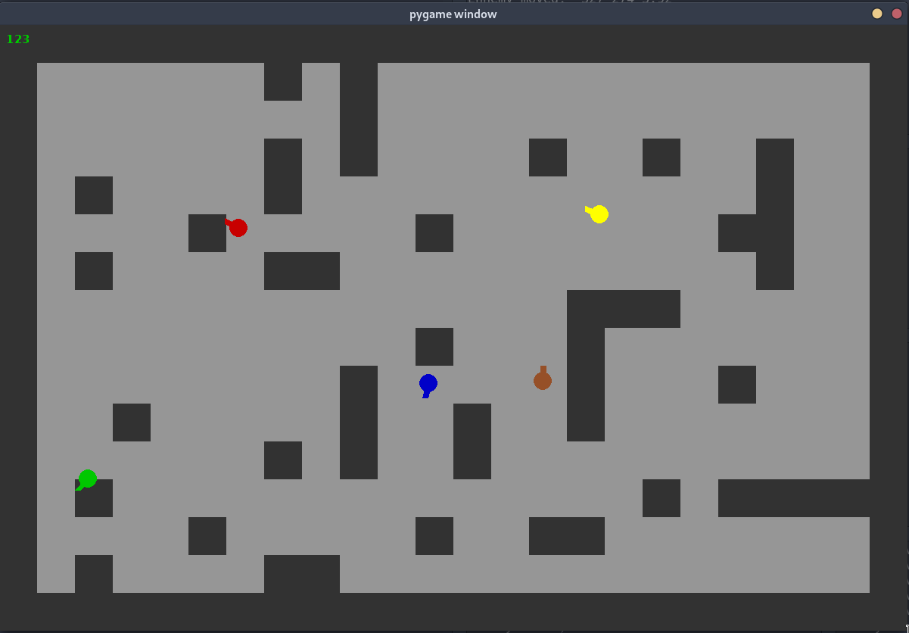

# TP5: Network Game

## Présentation

Le programme livré est une simple PoC de la création d'un protocole pour échanger des informations avec plusieurs clients sous la forme d'un jeu en 2D.  
Par conséquent, il n'y a pas de "but" ni de réel gameplay à part tourner en rond et se taper contre des murs. Mais on peut le faire à plusieurs !


## Installation

Pour installer le programme:

```bash
$ git clone git@github.com:GammaRay99/linux-reseau-leo.git
$ cp -r ./linux-reseau-leo/tp5/src/ ./network_game
```

## Utilisation

Pour lancer le serveur:

```bash
$ cd network_game
$ python3 server.py -p 12345
```

Pour lancer un client:

```bash
$ python3 client.py -i 127.0.0.1 -p 12345
```

Note: pour lancer le serveur ou le client, il est nécessaire que tout les autres fichiers python soit présent dans le même dossier. (si on veut seulement lancer le serveur, le fichier client.py n'est pas nécessaire et vice-versa)

Une fois la fenêtre du client lancé, les touches "z" et "s" permettent d'avancer et de reculer, et les touches "q" et "d" permettent de se tourner.

## Protocole

Sur le réseau, les messages envoyés respectent tous ce format:

```
 00    00   00 00 00 00 00 00 00 00 
-ID-|-TYPE-|---------DATA----------|
```

- ID correspond à l'id du joueur.
- TYPE correspond au type de message, ci-dessous la liste des types existant:
	- ``SERVER_FULL: 0xf0``   (connexion refusée)
	- ``CLIENT_HELLO: 0x01``  (demande de connexion)
	- ``SERVER_HELLO: 0xf1``  (connexion acceptée)
	- ``CLIENT_UPDATE: 0x02`` (déplacement du joueur) 
	- ``SERVER_UPDATE: 0xf2`` (déplacement d'un joueur)
	- ``CLIENT_FREEZE: 0x03`` ("mort" du joueur) 
	- ``SERVER_FREEZE: 0xf3`` ("mort" d'un joueur) 
	- ``CLIENT_GOODBYE: 0x0f``(signal déconnexion)
	- ``SERVER_GOODBYE: 0xff``(demande/confirmation de déconnexion)
- DATA correspond aux données accompagnant le message

Lorsqu'un client se connecte pour la première fois au serveur, voici le packet à envoyer:

```
CLIENT -> SERVEUR : {ID: 0xff, TYPE: CLIENT_HELLO, DATA: (empty)}
```

Le serveur pourra alors répondre 2 paquets différents en fonction du nombre de client déjà connecté.  
Si la limite est atteinte, le serveur répondra:  
```
SERVEUR -> CLIENT {ID: 0xff, TYPE: SERVER_FULL, DATA: (empty)}
``` 
La connexion sera ensuite fermée.

Si il reste de la place pour le nouveau client, le serveur répondra:
```
SERVEUR -> CLIENT {ID: (unique_id), TYPE: SERVER_HELLO, DATA: (x_spawn, y_spawn, empty)}
``` 

La connexion est établie, le client peut jouer normalement.

----

Lorsque le serveur envoie un message à un client, le champ ID ne correspond pas forcément à ce dernier. En effet, la réception d'un ``SERVEUR_UPDATE`` peut indiquer au client destinataire qu'un autre client s'est déplacé. L'inverse n'est pas vrai, un message envoyé d'un client vers le serveur contiendra toujours l'ID du client.
