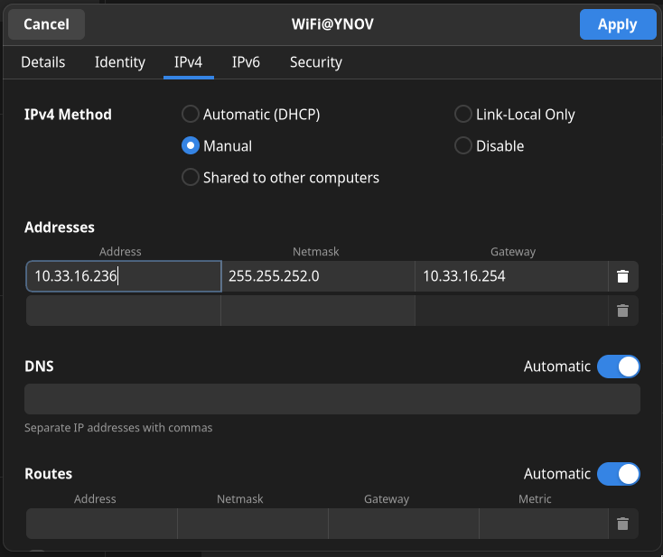

# Sommaire
- [B2 Réseau 2022 - TP1](#b2-réseau-2022---tp1)
- [TP1 - Mise en jambes](#tp1---mise-en-jambes)
- [Sommaire](#sommaire)
- [Déroulement et rendu du TP](#déroulement-et-rendu-du-tp)
- [I. Exploration locale en solo](#i-exploration-locale-en-solo)
  - [1. Affichage d'informations sur la pile TCP/IP locale](#1-affichage-dinformations-sur-la-pile-tcpip-locale)
    - [En ligne de commande](#en-ligne-de-commande)
    - [En graphique (GUI : Graphical User Interface)](#en-graphique-gui--graphical-user-interface)
    - [Questions](#questions)
  - [2. Modifications des informations](#2-modifications-des-informations)
    - [A. Modification d'adresse IP (part 1)](#a-modification-dadresse-ip-part-1)
    - [B. Table ARP](#b-table-arp)
    - [C. `nmap`](#c-nmap)
    - [D. Modification d'adresse IP (part 2)](#d-modification-dadresse-ip-part-2)
- [II. Exploration locale en duo](#ii-exploration-locale-en-duo)
  - [1. Prérequis](#1-prérequis)
  - [2. Câblage](#2-câblage)
  - [Création du réseau (oupa)](#création-du-réseau-oupa)
  - [3. Modification d'adresse IP](#3-modification-dadresse-ip)
  - [4. Utilisation d'un des deux comme gateway](#4-utilisation-dun-des-deux-comme-gateway)
  - [5. Petit chat privé](#5-petit-chat-privé)
  - [6. Firewall](#6-firewall)
- [III. Manipulations d'autres outils/protocoles côté client](#iii-manipulations-dautres-outilsprotocoles-côté-client)
  - [1. DHCP](#1-dhcp)
  - [2. DNS](#2-dns)
- [IV. Wireshark](#iv-wireshark)
- [Bilan](#bilan)

# Déroulement et rendu du TP

//

**⚠️ ⚠️ Désactivez votre firewall pour ce TP. ⚠️ ⚠️**

# I. Exploration locale en solo

## 1. Affichage d'informations sur la pile TCP/IP locale

### En ligne de commande

En utilisant la ligne de commande (CLI) de votre OS :

**🌞 Affichez les infos des cartes réseau de votre PC**

- interface wifi : wlp0s20f3, 44:af:28:c4:66:70, 10.33.16.119/22
- interface Ethernet : enp8s0, 08:97:98:d4:fb:50, pas d'adresse IP
```
$ ip a
1: lo: <LOOPBACK,UP,LOWER_UP> mtu 65536 qdisc noqueue state UNKNOWN group default qlen 1000
    link/loopback 00:00:00:00:00:00 brd 00:00:00:00:00:00
    inet 127.0.0.1/8 scope host lo
       valid_lft forever preferred_lft forever
    inet6 ::1/128 scope host 
       valid_lft forever preferred_lft forever
2: enp8s0: <NO-CARRIER,BROADCAST,MULTICAST,UP> mtu 1500 qdisc fq_codel state DOWN group default qlen 1000
    link/ether 08:97:98:d4:fb:50 brd ff:ff:ff:ff:ff:ff
3: wlp0s20f3: <BROADCAST,MULTICAST,UP,LOWER_UP> mtu 1500 qdisc noqueue state UP group default qlen 1000
    link/ether 44:af:28:c4:66:70 brd ff:ff:ff:ff:ff:ff
    inet 10.33.16.119/22 brd 10.33.19.255 scope global dynamic noprefixroute wlp0s20f3
       valid_lft 76666sec preferred_lft 76666sec
```

**🌞 Affichez votre gateway**

- utilisez une commande pour connaître l'adresse IP de la [passerelle](../../cours/lexique.md#passerelle-ou-gateway) de votre carte WiFi
```
$ ip n s
10.33.19.254 dev wlp0s20f3 lladdr 00:c0:e7:e0:04:4e REACHABLE
```

### En graphique (GUI : Graphical User Interface)

En utilisant l'interface graphique de votre OS :  

**🌞 Trouvez comment afficher les informations sur une carte IP (change selon l'OS)**

- trouvez l'IP, la MAC et la [gateway](../../cours/lexique.md#passerelle-ou-gateway) pour l'interface WiFi de votre PC


### Questions

- 🌞 à quoi sert la [gateway](../../cours/lexique.md#passerelle-ou-gateway) dans le réseau d'YNOV ?
- La gateway sert à connecter le LAN d'Ynov aux autres LAN sur internet ( à avoir internet quoi )

## 2. Modifications des informations

### A. Modification d'adresse IP (part 1)  

🌞 Utilisez l'interface graphique de votre OS pour **changer d'adresse IP** :

- changez l'adresse IP de votre carte WiFi pour une autre
- ne changez que le dernier octet
  - par exemple pour `10.33.1.10`, ne changez que le `10`
  - valeur entre 1 et 254 compris


```
$ ip a
  [...]
  3: wlp0s20f3: <BROADCAST,MULTICAST,UP,LOWER_UP> mtu 1500 qdisc noqueue state UP group default qlen 1000
    link/ether 44:af:28:c4:66:70 brd ff:ff:ff:ff:ff:ff
    inet 10.33.16.236/22 brd 10.33.19.255 scope global noprefixroute wlp0s20f3
       valid_lft forever preferred_lft forever
  [...]

$ ping 8.8.8.8
PING 8.8.8.8 (8.8.8.8) 56(84) bytes of data.
From 10.33.16.236 icmp_seq=1 Destination Host Unreachable
From 10.33.16.236 icmp_seq=2 Destination Host Unreachable
From 10.33.16.236 icmp_seq=3 Destination Host Unreachable
```

🌞 **Il est possible que vous perdiez l'accès internet.** Que ce soit le cas ou non, expliquez pourquoi c'est possible de perdre son accès internet en faisant cette opération.

- L'adresse IP que j'ai choisie (10.33.16.236) est déjà prise, donc je n'ai plus accès à internet.

---

- **NOTE :** si vous utilisez la même IP que quelqu'un d'autre, il se passerait la même chose qu'en vrai avec des adresses postales :
  - deux personnes habitent au même numéro dans la même rue, mais dans deux maisons différentes
  - quand une de ces personnes envoie un message, aucun problème, l'adresse du destinataire est unique, la lettre sera reçue
  - par contre, pour envoyer un message à l'une de ces deux personnes, le facteur sera dans l'impossibilité de savoir dans quelle boîte aux lettres il doit poser le message
  - ça marche à l'aller, mais pas au retour

### B. Table ARP

La table ARP c'est votre "table de voisinnage". Elle contient la liste des adresses MAC des machines avec qui vous avez communiqué récemment.

Quand deux machines communiquent, elles enregistrent mutuellement l'adresse MAC et l'adresse IP de l'autre dans cette table.

> L'échange d'adresse MAC se fait de façon automatique, dès qu'on essaie de contacter une machine via son IP, et se fait à l'aide du protocole ARP, que nous verrons plus tard.

🌞 Exploration de la table ARP

```
$ ip neighbor
10.33.19.254 dev wlp0s20f3 lladdr 00:c0:e7:e0:04:4e REACHABLE
```
- depuis la ligne de commande, afficher la table ARP
- identifier l'adresse MAC de la passerelle de votre réseau, et expliquer comment vous avez repéré cette adresse MAC spécifiquement

Je sais que l'adresse de la passerelle est probablement x.x.x.234 donc, son adresse mac est 00:c0:e7:e0:04:4e ( et puis c'est aussi la seule entrée dans la table arp donc c'est forcément la gateway )

🌞 Et si on remplissait un peu la table ?

- envoyez des ping vers des IP du même réseau que vous. Lesquelles ? menfou, random. Envoyez des ping vers au moins 3-4 machines.
- affichez votre table ARP
- listez les adresses MAC associées aux adresses IP que vous avez ping

```
$ ip neighbor
10.33.19.236 dev wlp0s20f3 FAILED 
10.33.19.110 dev wlp0s20f3 FAILED 
10.33.19.254 dev wlp0s20f3 lladdr 00:c0:e7:e0:04:4e DELAY 
10.33.19.111 dev wlp0s20f3 FAILED
```
---

Ping des IP pour savoir si elles sont disponibles, c'est possible, mais c'est chiant.  
Ca serait bien un outil pour scanner le réseau à un instant T afin de choisir une adresse IP libre, non ? oui

# II. Exploration locale en duo
## 1. Prérequis

- deux PCs avec ports RJ45
- un câble RJ45
- **firewalls désactivés** sur les deux PCs

## 2. Câblage

Ok c'est la partie tendue. Prenez un câble. Branchez-le des deux côtés. **Bap.**

## Création du réseau (oupa)

Cette étape peut paraître cruciale. En réalité, elle n'existe pas à proprement parlé. On ne peut pas "créer" un réseau. Si une machine possède une carte réseau, et si cette carte réseau porte une adresse IP, alors cette adresse IP se trouve dans un réseau (l'adresse de réseau). Ainsi, le réseau existe. De fait.  

**Donc il suffit juste de définir une adresse IP sur une carte réseau pour que le réseau existe ! Bap.**

## 3. Modification d'adresse IP

🌞Si vos PCs ont un port RJ45 alors y'a une carte réseau Ethernet associée :
```
$ ping 192.168.0.2
PING 192.168.0.2 (192.168.0.2) 56(84) bytes of data.
64 bytes from 192.168.0.2: icmp_seq=1 ttl=64 time=0.481 ms
64 bytes from 192.168.0.2: icmp_seq=2 ttl=64 time=0.930 ms
64 bytes from 192.168.0.2: icmp_seq=3 ttl=64 time=1.30 ms
64 bytes from 192.168.0.2: icmp_seq=4 ttl=64 time=0.638 ms
``` 
```
$ ip n
10.33.19.254 dev wlp0s20f3 lladdr 00:c0:e7:e0:04:4e REACHABLE 
192.168.0.2 dev enp8s0 lladdr a0:ce:c8:ee:d4:14 STALE 
```

## 4. Utilisation d'un des deux comme gateway

- vous allez désactiver Internet sur une des deux machines, et vous servir de l'autre machine pour accéder à internet.

```schema
  Internet           Internet
     X                   |
     X                  WiFi
     |                   |
    PC 1 ---Ethernet--- PC 2
    
- internet joignable en direct par le PC 2
- internet joignable par le PC 1, en passant par le PC 2
```

- pour ce faiiiiiire :
  - désactivez l'interface WiFi sur l'un des deux postes
  - s'assurer de la bonne connectivité entre les deux PCs à travers le câble RJ45
  - **sur le PC qui n'a plus internet**
    - sur la carte Ethernet, définir comme passerelle l'adresse IP de l'autre PC
  - **sur le PC qui a toujours internet**
    - sur Windows, il y a une option faite exprès (google it. "share internet connection windows 10" par exemple)
    - sur GNU/Linux, faites le en ligne de commande ou utilisez [Network Manager](https://help.ubuntu.com/community/Internet/ConnectionSharing) (souvent présent sur tous les GNU/Linux communs)
    - sur MacOS : toute façon vous avez pas de ports RJ, si ? :o (google it sinon)

---

- 🌞 pour tester la connectivité à internet on fait souvent des requêtes simples vers un serveur internet connu
  - encore une fois, un ping vers un DNS connu comme `1.1.1.1` ou `8.8.8.8` c'est parfait
- 🌞 utiliser un `traceroute` ou `tracert` pour bien voir que les requêtes passent par la passerelle choisie (l'autre le PC)

```
pierre in ~/Ynov/TP-Leo on main ● λ traceroute 1.1.1.1
traceroute to 1.1.1.1 (1.1.1.1), 64 hops max, 52 byte packets
 1  10.42.0.1 (10.42.0.1)  2.240 ms  1.728 ms  1.716 ms
 2  10.33.19.254 (10.33.19.254)  10.015 ms  6.610 ms  5.421 ms
 3  77.196.149.137 (77.196.149.137)  7.073 ms  5.043 ms  6.119 ms
 4  212.30.97.108 (212.30.97.108)  11.836 ms  12.928 ms  11.890 ms
 5  77.136.172.222 (77.136.172.222)  24.746 ms  25.119 ms  24.035 ms
 6  77.136.172.221 (77.136.172.221)  22.290 ms  24.031 ms  22.527 ms
 7  77.136.10.221 (77.136.10.221)  24.212 ms  24.861 ms  24.207 ms
 8  77.136.10.221 (77.136.10.221)  24.557 ms  24.163 ms  25.949 ms
 9  141.101.67.254 (141.101.67.254)  24.733 ms  23.722 ms  30.411 ms
10  172.71.120.2 (172.71.120.2)  32.182 ms
    172.71.124.2 (172.71.124.2)  27.189 ms
    172.71.120.2 (172.71.120.2)  28.005 ms
11  1.1.1.1 (1.1.1.1)  25.461 ms  24.462 ms  22.352 ms
```