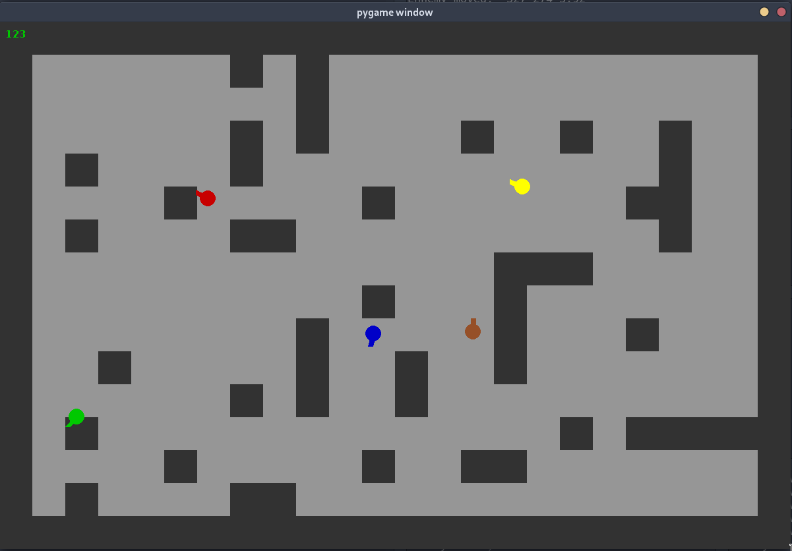

# TP5: Network Game

## Présentation

Le programme livré est une simple PoC de la création d'un protocole pour échanger des informations avec plusieurs clients sous la forme d'un jeu en 2D.  
Par conséquent, il n'y a pas de "but" ni de réel gameplay à part tourner en rond et se taper contre des murs. Mais on peut le faire à plusieurs !


## Installation

Pour installer le programme:

```bash
$ git clone 
```